# Wallpapers
This README is auto-generated. You may view its source code [here](./main.go).  Showcases are randomly chosen. Files
are shuffled, then the first two from each category are chosen.

## Showcase
Categorized wallpaper showcase. two pictures per category.

## [abstract](.././abstract)
  
 
  
 [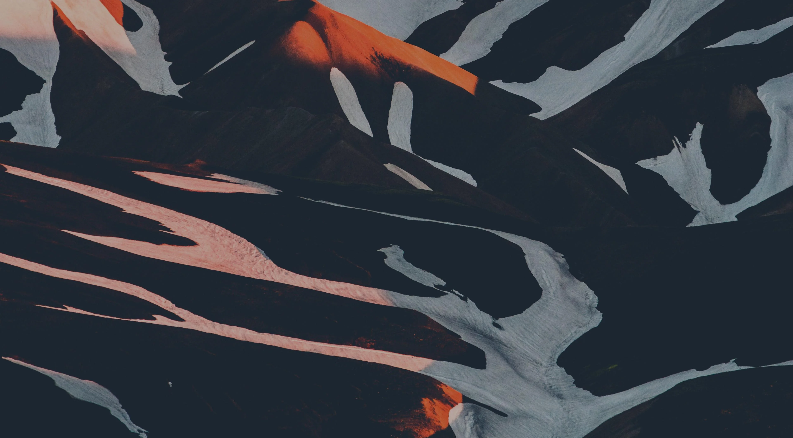](.././abstract/a_snow_covered_mountains_with_a_red_and_white_line.webp)
  

## [anime](.././anime)
  
 
  
 [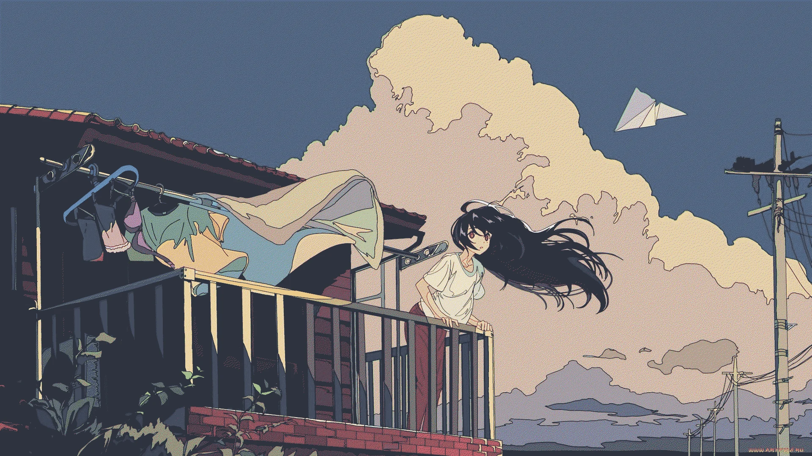](.././anime/a_cartoon_of_a_woman_on_a_balcony.webp)
  

## [apocalypse](.././apocalypse)
  
 [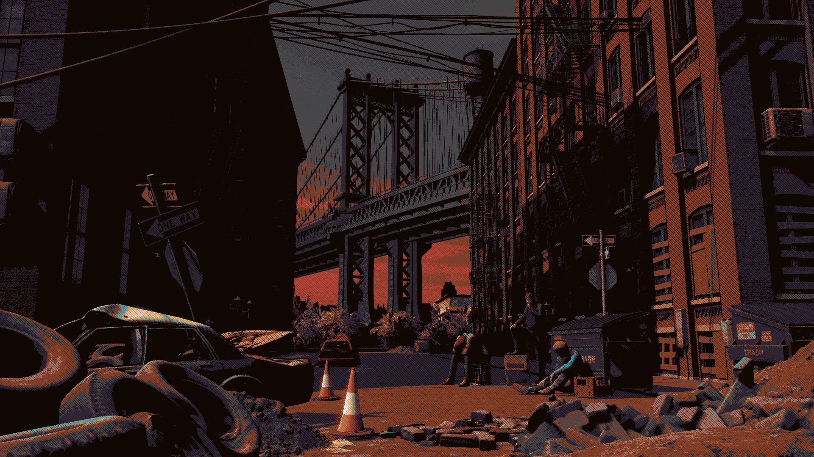](.././apocalypse/a_street_with_a_bridge_and_people_sitting_on_it.webp)
  
 
  

## [arcane](.././arcane)
  
 [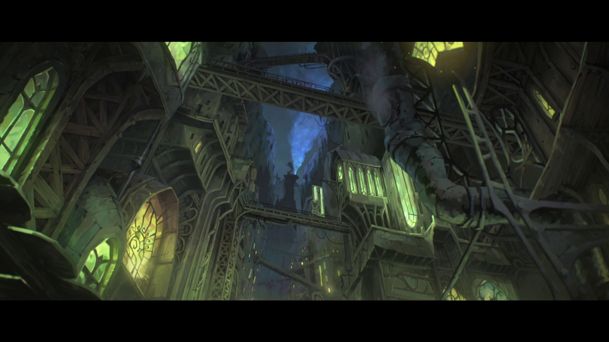](.././arcane/a_screenshot_of_a_video_game_01.webp)
  
 
  

## [catppuccin](.././catppuccin)
  
 
  
 [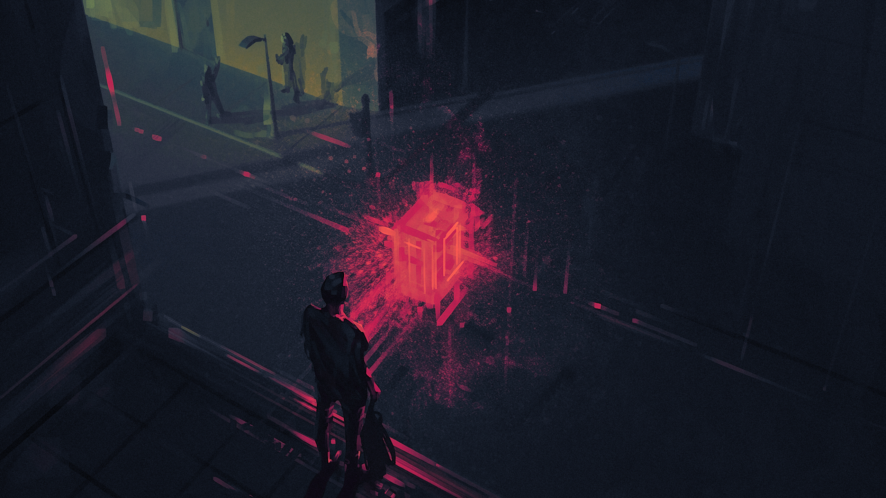](.././catppuccin/a_man_standing_on_a_sidewalk_looking_at_a_glowing_cube.webp)
  

## [cyberpunk](.././cyberpunk)
  
 [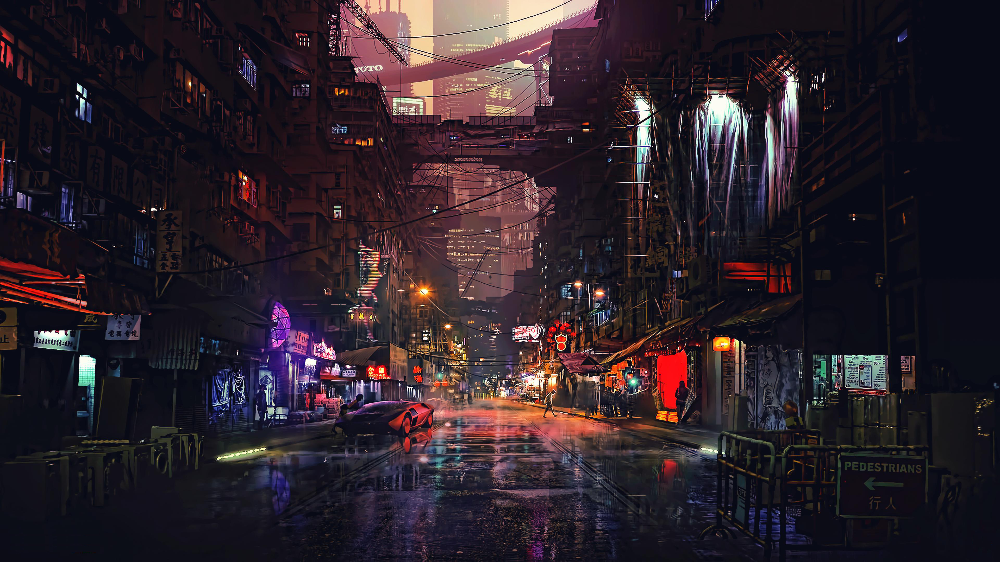](.././cyberpunk/a_city_street_with_buildings_and_a_bridge.webp)
  

## [memes](.././memes)
  
 [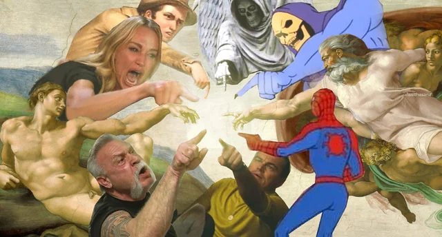](.././memes/a_man_pointing_at_a_man_pointing_at_a_man.webp)
  
 
  

## [minimalistic](.././minimalistic)
  
 [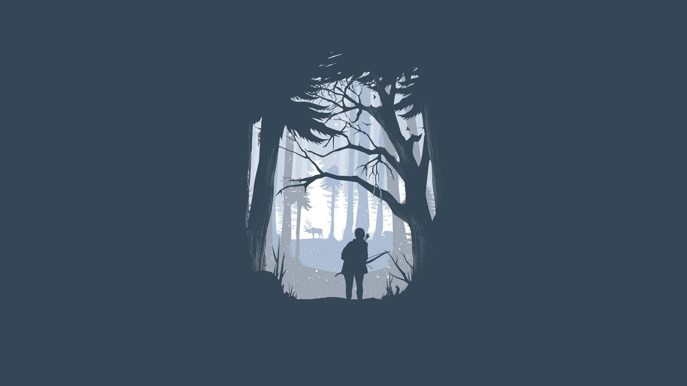](.././minimalistic/a_man_standing_in_a_forest.webp)
  
 
  

## [nature](.././nature)
  
 [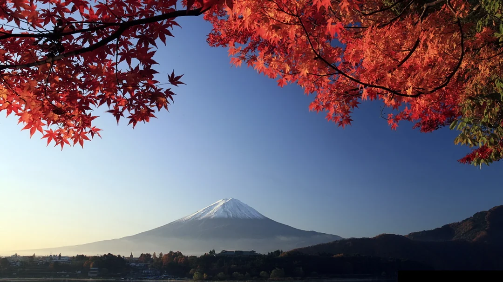](.././nature/a_tree_with_red_leaves_and_Mount_Fuji_in_the_background.webp)
  
 
  

## [nord](.././nord)
  
 
  
 
  

## [pixelart](.././pixelart)
  
 [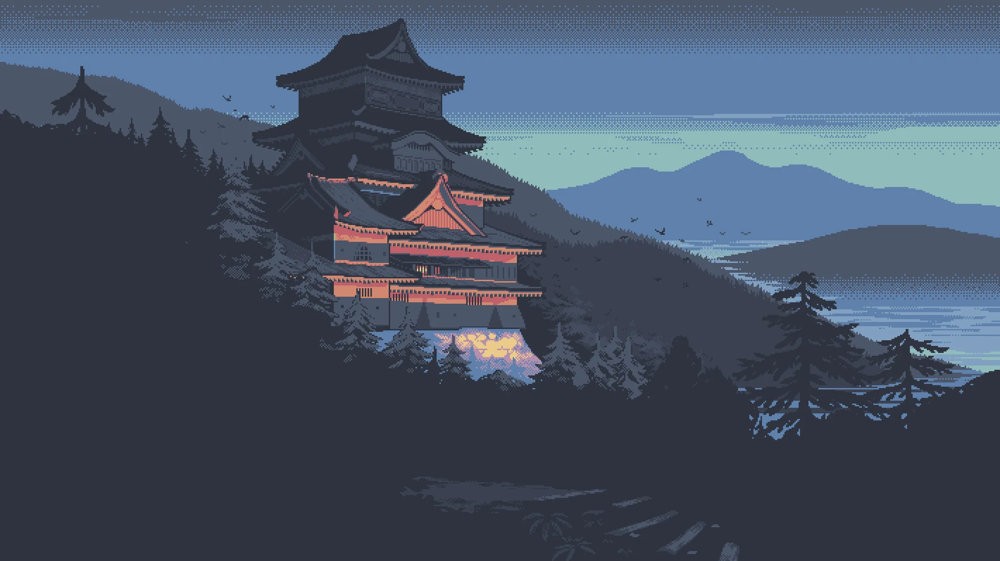](.././pixelart/a_building_on_a_hill.webp)
  

## [scifi](.././scifi)
  
 
  

## [space](.././space)
  
 
  
 [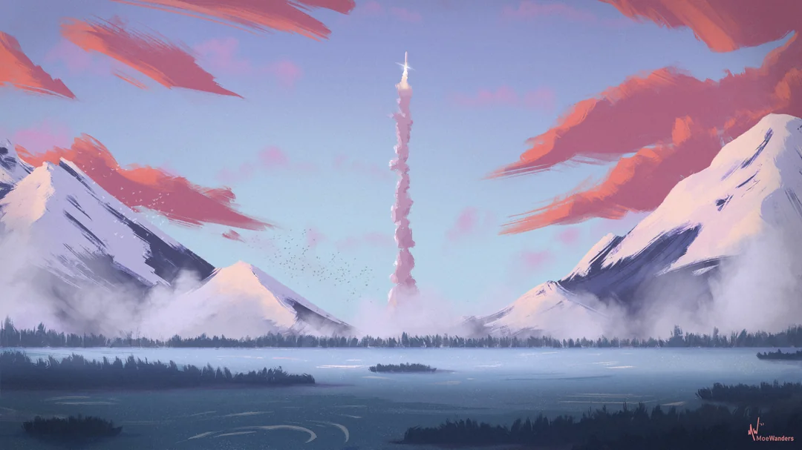](.././space/a_rocket_launching_into_the_sky.webp)
  

## [uncategorized](.././uncategorized)
  
 [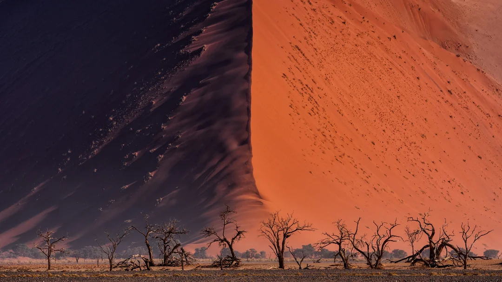](.././uncategorized/a_sand_dune_with_trees_in_the_foreground.webp)
  
 
  

## Ending Note
You may use [download-directory](https://download-directory.github.io/) or [GitZip](https://gitzip.org/) for downloading
 a specific directory.

I do not own these images. All credits belong to the respective artists.
