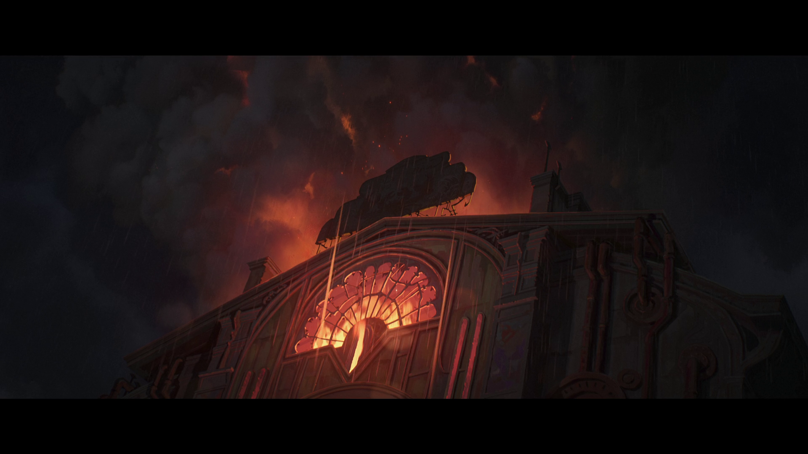

# Wallpapers
This README is auto-generated. You may view its source code [here](./main.go).  Showcases are randomly chosen. Files
are shuffled, then the first two from each category are chosen.

## Showcase
Categorized wallpaper showcase. two pictures per category.

## [abstract](.././abstract)
  
 
  
 
  

## [anime](.././anime)
  
 
  
 
  

## [apocalypse](.././apocalypse)
  
 
  
 
  

## [arcane](.././arcane)
  
 
  
 
  

## [catppuccin](.././catppuccin)
  
 
  
 
  

## [cyberpunk](.././cyberpunk)
  
 
  

## [memes](.././memes)
  
 
  
 
  

## [minimalistic](.././minimalistic)
  
 
  
 
  

## [nature](.././nature)
  
 
  
 
  

## [nord](.././nord)
  
 
  
 
  

## [pixelart](.././pixelart)
  
 
  

## [scifi](.././scifi)
  
 
  

## [space](.././space)
  
 
  
 
  

## [uncategorized](.././uncategorized)
  
 
  
 
  

## Ending Note
You may use [download-directory](https://download-directory.github.io/) or [GitZip](https://gitzip.org/) for downloading
 a specific directory.

I do not own these images. All credits belong to the respective artists.
